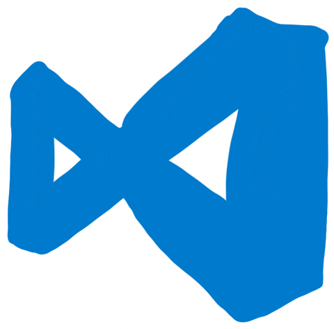
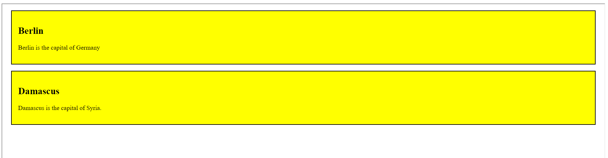
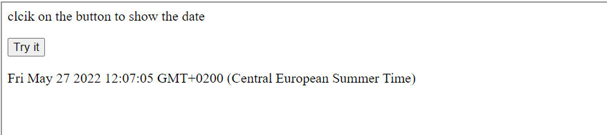

# Web Editor


##  I set up this site to test my code or ideas as quickly as possible without spending time setting up Vs code or any other development environment.

<br>

## However, for complex projects you need a development environment like our lover Vs code
<br>

<br>

## Example: 

``` HTML
    <!DOCTYPE html>
    <html>
    <head>
    <style>
    .city {
            background-color: yellow;
            color: black;
            border: 2px solid black;
            margin: 20px;
            padding: 20px;
    }
    </style>
    </head>
    <body>

     <div class="city">
        <h2>Berlin</h2>
        <p>Berlin is the capital of Germany</p>
    </div> 

    <div class="city">
        <h2>Damascus</h2>
        <p>Damascus is the capital of Syria.</p>
    </div>


    </body>
    </html>


}
```
<br>

<br>

``` HTML
<!DOCTYPE html>
<html>
<body>
    <p>clcik on the button to show the date</p>
    <button id="myBtn">Try it</button>
    <p id="demo"></p>
<script>
    document.getElementById("myBtn").addEventListener("click", displayDate);

    function displayDate() {
    document.getElementById("demo").innerHTML = Date();
    }
</script>
</body>
</html> 

```
<br>

<br>

Happy Hack;) 

<br>


<br>